# [Spring] 종합 여행 사이트 Naman Trip (숙소예약, 여행일정, 맛집, 패키지 예약)

## 개발 환경

<table>
    <tr>
        <th>프로젝트명</th>
        <th>Naman Trip</th>
        <th>개발 기간</th>
        <th>2021.03.03. ~ 2020.03.19</th>
    </tr>
    <tr>
        <th>프로젝트 개요</th>
        <th>여행 관련 정보, 예약을 한곳에서 할 수 있는 사이트</th>
        <th>개발환경</th>
        <th>Windows 10</th>
    </tr>
    <tr>
        <th>개발언어</th>
        <th>Java(JDK 1.8), HTML, CSS, JavaScript</th>
        <th>형상관리</th>
        <th>Github, Git Bash, Git Desktop</th>
    </tr>
    <tr>
        <th>개발도구</th>
        <th>STS 3.9, VSCode, sqldeveloper</th>
        <th>사용기술</th>
        <th>Apache, Oracle, Spring framework</th>
    </tr>
     <tr>
        <th>개발 인원</th>
        <th colspan="3">6명 : 김영범(팀장), 권주홍, 박영수, 조혜승, 윤지봉, 정경화 </th>
    </tr>
</table>

## 목적
여행 관련 정보, 예약을 한곳에서 할 수 있는 사이트를 만든다

## 데이터 구조
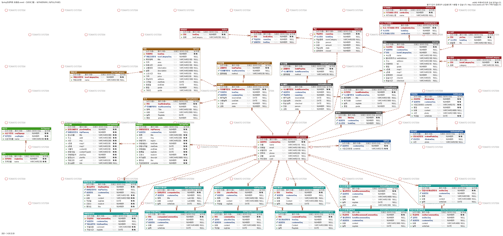

## 주요 기능
- 숙박 예약
- 여행일정 만들기
- 맛집 추천
- 패키지 및 여행 티켓 예약 가능

## 담당한 업무 - 여행일정 만들기
- 메인 페이지
- 여행 기본정보 입력(여행 이름, 여행 지역, 여행 시작일, 여행 종료일, 설명)
- 여행 일정정보
  - DAY 추가, 삭제 가능
  - 여행 지역, 시군구, 테마별 검색 가능
  - 검색 결과 클릭시 지도에 마커 생성, 오버레이로 해당 관광지 이름 표시
  - 정보보기 클릭시 관광지 정보를 확인 가능
  - 일정추가 버튼 또는 드래그로 일정에 추가할 수 있다 -> 지도에 테마별 숫자 마커로 표시된다
  - 일정목록의 아이템을 삭제할 수 있다
  - 일정 추가한 마커를 누르면 커스텀 오버레이가 표시된다
  - 좌측 일정목록의 순서를 드래그앤 드롭으로 바꿀 수 있다

- 여행일정 상세 페이지
  - 스크롤이 위치할때 지도의 마커가 바뀐다
  - 좌측 사이드 네비게이션을 통해 DAY를 이동할 수 있다
  - 여행지의 정보를 볼 수 있다
 
- 여행일정을 수정, 삭제 가능하다

### 메인 페이지
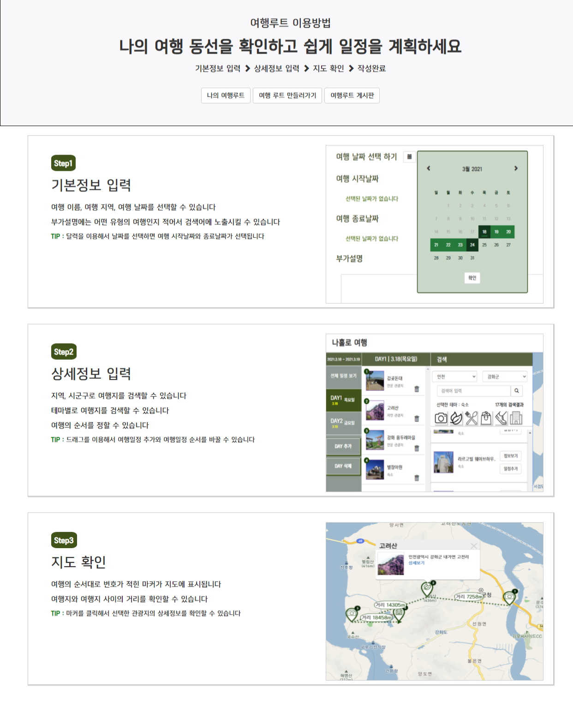

### 여행 기본정보 입력
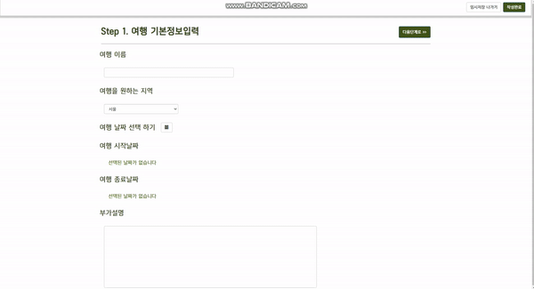

### 여행 일정정보 - DAY 추가삭제
좌측에 있는 DAY 추가, 삭제 가능  
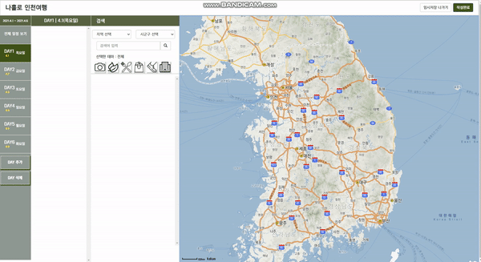

### 여행 일정정보 - 검색
여행 지역, 시군구, 테마별 검색 가능  
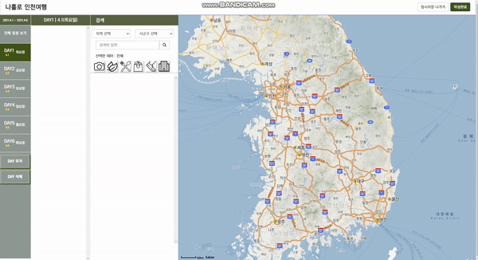

### 여행 일정정보 - 마커, 여행지정보
검색 결과 클릭시 지도에 마커 생성, 오버레이로 해당 관광지 이름 표시  
정보보기 클릭시 관광지 정보를 확인 가능  
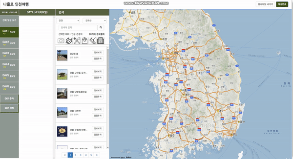

### 여행 일정정보 - 일정추가
일정추가 버튼 또는 드래그로 일정에 추가할 수 있다  
지도에 순서마커로 표시된다 마커는 테마별로 모양이 다르다  
일정목록의 아이템을 삭제할 수 있다  
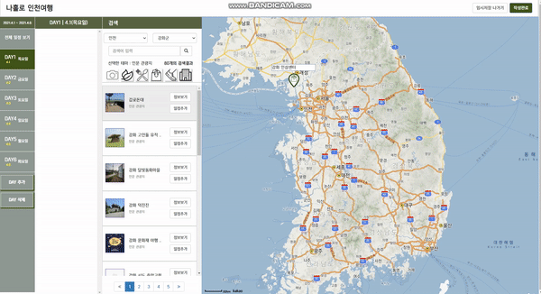

### 여행 일정정보 - 커스텀 오버레이
일정 추가한 마커를 누르면 커스텀 오버레이가 표시된다  
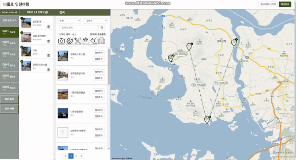

### 여행 일정정보 - 순서변경
좌측 일정목록의 순서를 드래그앤 드롭으로 바꿀 수 있다  
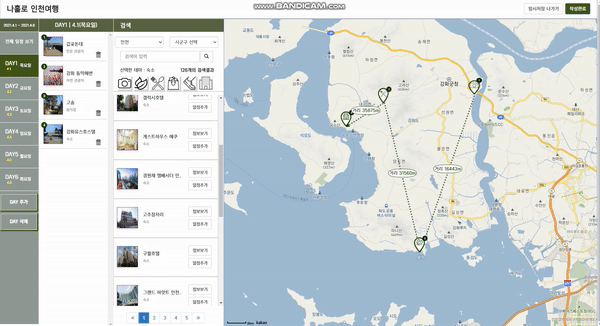

### 여행 일정정보 - DAY별 일정추가  
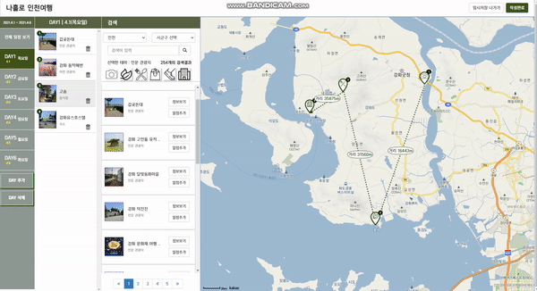

### 여행일정 상세 페이지
스크롤이 위치할때 지도의 마커가 바뀐다   
좌측 사이드 네비게이션을 통해 DAY를 이동할 수 있다  
여행지의 정보를 볼 수 있다  
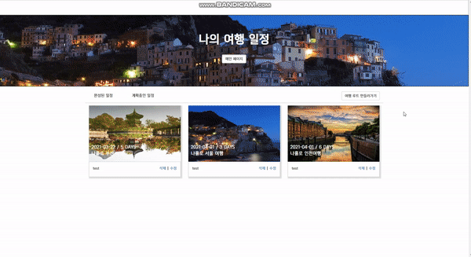

### 여행일정 수정
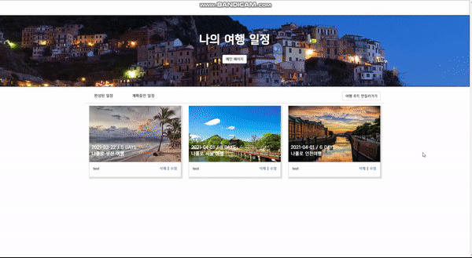

### 여행일정 삭제
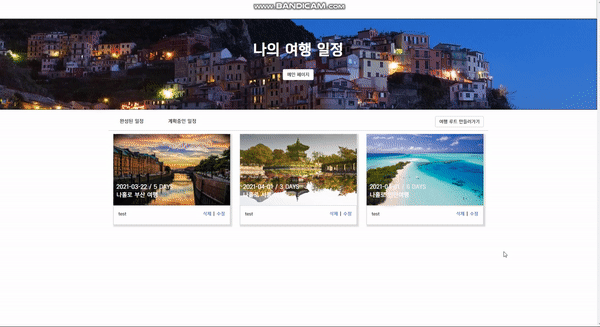

## 후기
여행 일정 만들기 기능을 구현할 때 관광정보 TOUR API 3.0과 kakaomap API를 사용했습니다. 처음엔 API를 사용해서 기능을 구현하는 게 막막했지만, 공식 문서와 예제 등을 참조해서 기능들을 하나씩 완성해 나갈 때마다 성취감을 느낄 수 있었고 어떤 기능이든지 만들 수 있겠다는 자신감도 얻었습니다. 그리고 이번 프로젝트에는 Spring Framework를 사용했는데 이전 프로젝트에서 사용했던 JSP&Servlet과 비교해서 초기 프로젝트 세팅 부분을 제외하고는 훨씬 더 편리하다고 느꼈습니다. Spring Framework가 제공해주는 MVC 패턴의 프로젝트로 생성할 수 있었고 @Controller과 @RequestMapping 어노테이션을 사용함으로써 JSP&Servlet에서처럼 페이지 하나당 하나의 servlet 클래스를 만들지 않아도 됐습니다. 또 Spring tiles를 이용해서 레이아웃 디자인을 편하게 할 수 있었습니다. 앞으로 Spring에 대해서도 더 깊이 있게 공부해볼 예정입니다
